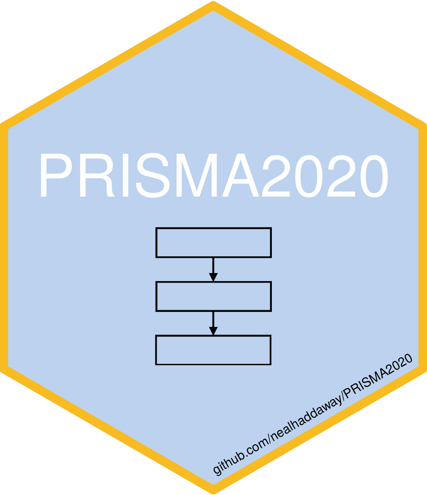

# PRISMA2020 Flow Chart 

You can use this package to produce a flow chart that conforms to the PRISMA 2020 preprint standards using the `PRISMA_flowchart()` function. The data can be manually entered into the function, or loaded up using the template CSV file provided in 'INST/EXTDATA/'. The function, (if 'interactive = TRUE') produces an interactive HTML ouput with each box linking to a specific page (e.g. of search results or methods details), and hover-over tooltips for further information. 
 

 
The 'Previous' and 'Other' study arms of the flowchart can be toggled on and off and removed or added to the chart by specifying this in the function inputs.

A static version is produced otherwise. <a href="https://srflowdiagram.github.io/template.html" target="_blank">
  
See the interactive template here.</a>

<!-- badges: start -->

<!-- badges: end -->
